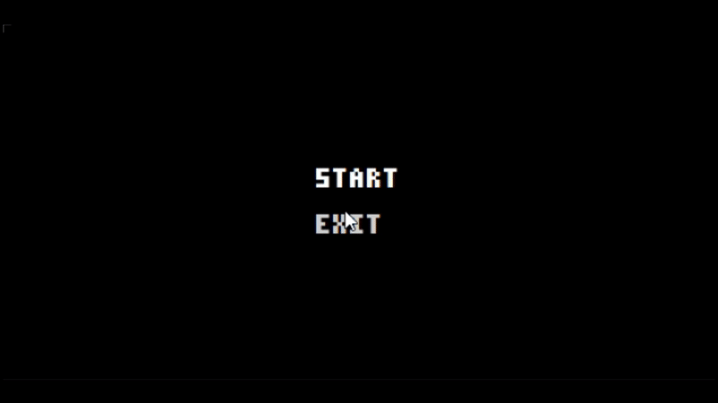
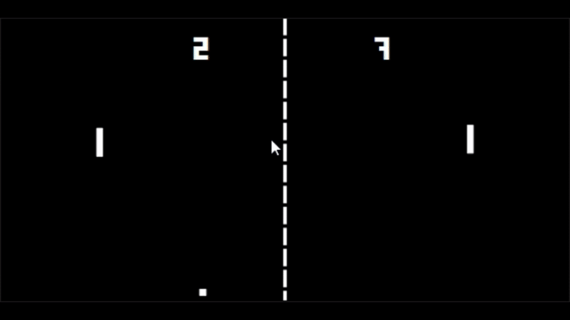
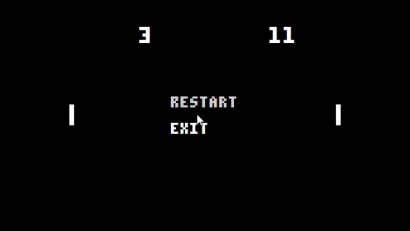

## About
I recreated the classic Atari Pong (1972) in Qt, keeping the original gameplay and style while adding start and game-over menus for convenience.

## Controls
- W/S for the left player
- Up/Down arrows for the right player

You can also close the game at any moment using the Esc key.

## Technical details
- Factory pattern for object creation
- Composition and inheritance
- Frame-rate–independent movement via timer-based updates
- Dynamic resizing scales the ball, players, and scores proportionally
- Used .qrc and .qss for buttons, a font, and an icon
- Dynamic angle adjustment for original gameplay
- Game state management supports start, restart, and game-over logic

## Gifs
### Start screen

### Gameplay

### End screen

## Build
[Pong v1.0.0 (Windows)](https://github.com/alsandbox/PongQt/releases/tag/v1.0.0)
